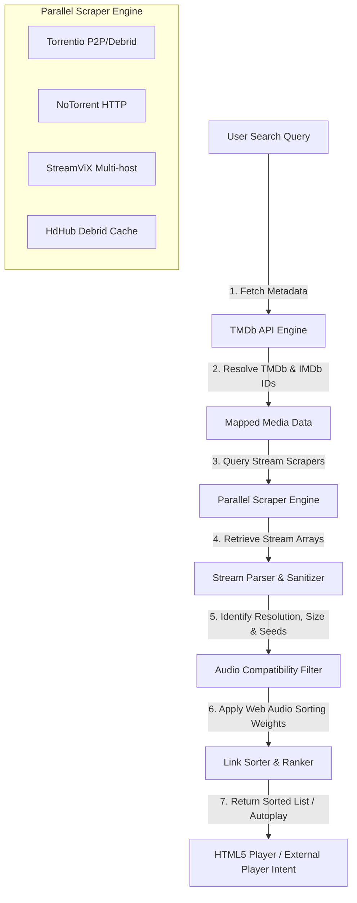

# Cinema HD Streaming & Movie Info Engine: AI Prompt Recipe

This file contains a detailed, comprehensive prompt designed to be copied and pasted into an AI coding assistant (like Gemini, Claude, or GPT) to implement or integrate the complete streaming and movie metadata engine from Cinema HD into another application.

***

```markdown
Role: Senior Software Engineer & Streaming Architecture Expert

Task: Implement a unified "Movie Information, Multi-Source Parallel Stream Scraper, and Link Resolver Engine" for a streaming media application. The system must fetch media metadata, query multiple P2P and direct-link indexers in parallel, parse and sort resolved streams by quality and premium status, check audio codec web-compatibility, and manage video playback options.

---

### Core Architecture & Flow Overview



---

### 1. Movie & Series Information Engine (TMDb / IMDb integration)

The engine must integrate with The Movie Database (TMDb) to handle media search, details, show structure, and trailer resolutions:

1. **Multi-Search API Route**:
   - Query: `https://api.themoviedb.org/3/search/multi?api_key={TMDB_API_KEY}&query={query}&language=en-US&page=1`
   - Handle response results, parsing title, release date, backdrop path, poster path, media type (movie or tv), and ID.

2. **Media Details API Route**:
   - Movie: `https://api.themoviedb.org/3/movie/{TMDB_ID}?api_key={TMDB_API_KEY}&append_to_response=videos,credits`
   - TV Show: `https://api.themoviedb.org/3/tv/{TMDB_ID}?api_key={TMDB_API_KEY}&append_to_response=videos,credits`
   - TV Show Season details: `https://api.themoviedb.org/3/tv/{TMDB_ID}/season/{SEASON_NUMBER}?api_key={TMDB_API_KEY}`

3. **IMDb ID Resolution (Crucial for Scrapers)**:
   - Scrapers rely on IMDb identifiers (`tt...`). Look up IMDb IDs from TMDb external ID endpoints:
     - Movie: `https://api.themoviedb.org/3/movie/{TMDB_ID}/external_ids?api_key={TMDB_API_KEY}`
     - TV Show: `https://api.themoviedb.org/3/tv/{TMDB_ID}/external_ids?api_key={TMDB_API_KEY}`
   - **Fallback Mapping (IMDb-to-TMDb)**:
     - If the app obtains metadata that only has an IMDb ID (e.g., from a Stremio catalog list item), query the TMDb find endpoint to resolve the TMDb ID:
       `https://api.themoviedb.org/3/find/{IMDB_ID}?api_key={TMDB_API_KEY}&external_source=imdb_id`

4. **Trailer Search**:
   - Parse the `videos` response array from TMDb. Look for video objects where `site === "YouTube"` and `type === "Trailer"`. Use the first match's `key` to display a responsive embedded YouTube player:
     `https://www.youtube.com/embed/{VIDEO_KEY}?autoplay=1&mute=0`

---

### 2. Multi-Source Parallel Stream Scraper & Link Resolver Engine

When a movie or a specific TV series episode (season and episode number) is selected, perform high-speed scraping of stream caches in parallel.

#### A. Scraper Endpoints
Formulate the query target based on media type:
- **Movies**: Query ID is `{IMDB_ID}` (e.g., `tt1234567`).
- **Series/Show Episodes**: Query ID is `{IMDB_ID}:{SEASON_NUMBER}:{EPISODE_NUMBER}` (e.g., `tt1234567:2:5`).
- Query Type parameters are `"movie"` or `"series"`.

Query the following endpoints in parallel (e.g., using `Promise.allSettled` to prevent single-endpoint timeouts from blocking the app):

1. **Torrentio (P2P / Real-Debrid)**:
   - If Real-Debrid API/access token is NOT provided:
     `https://torrentio.strem.fun/providers=yts,eztv,rarbg,1337x,thepiratebay,torrentgalaxy/stream/{queryType}/{queryId}.json`
   - If Real-Debrid API/access token IS provided:
     `https://torrentio.strem.fun/providers=yts,eztv,rarbg,1337x,thepiratebay,torrentgalaxy|realdebrid={RD_TOKEN}/stream/{queryType}/{queryId}.json`

2. **NoTorrent (Direct HTTP / HLS)**:
   - URL: `https://addon.notorrent2.workers.dev/stream/{queryType}/{queryId}.json`

3. **StreamViX (Direct Stream Cache)**:
   - URL: `https://streamvix.hayd.uk/%7B%22tmdbApiKey%22%3A%22%22%2C%22mediaFlowProxyUrl%22%3A%22%22%2C%22mediaFlowProxyPassword%22%3A%22%22%2C%22animeunityEnabled%22%3A%22on%22%2C%22animesaturnEnabled%22%3A%22on%22%2C%22animeworldEnabled%22%3A%22on%22%7D/stream/{queryType}/{queryId}.json`

4. **HdHub (Debrid Cache)**:
   - URL: `https://hdhub.thevolecitor.qzz.io/eyJ0b3Jib3giOiJ1bnNldCIsInF1YWxpdGllcyI6IjIxNjBwLDEwODBwLDcyMHAiLCJzb3J0IjoiZGVzYyJ9/stream/{queryType}/{queryId}.json`

#### B. Stream Parsing & Filtering Rules
Parse each returned stream configuration object from the JSON responses. A stream object typically has:
- `title` (raw string containing video filename, size, and source markers).
- `url` (direct play link) or `infoHash` / `fileIdx` (for raw torrent streams). If an direct URL is not present and Real-Debrid is disabled, the app must handle fallback P2P streaming (or exclude raw torrents if native web views require direct HTTP streams).
- Filter out non-playable URLs (e.g. URLs ending in `.zip` or `.rar`, or containing server login loops like `login.php` or unauthorized `hubcloud` redirects).

**Parsing Fields from Stream Title**:
- **Resolution**:
  - Detect `2160p` / `4k` -> label as `4K`
  - Detect `1080p` -> label as `1080p`
  - Detect `720p` -> label as `720p`
  - Default -> label as `SD` or `RD/Direct` depending on provider.
- **File Size**: Extract using regex looking for GB/MB size formats (e.g., `/💾\s*([^\]]+)/` or general numbers followed by `GB` or `MB`). Default to "Direct Stream" if absent.
- **Seeds/Source**: Parse peer/seed count. For direct HTTP/HLS sources, default seeds metadata to `🚀 Direct HTTP`.

#### C. Audio Compatibility Check
Modern browsers and WebViews inside lightweight media players (like Firesticks, Android Smart TVs) often fail to decode multi-channel HD audio codecs, resulting in video playing with absolute silence. The engine must scan the stream title string to identify and flag these:

1. **Uncompatible/HD Audio Codecs**:
   - Scan title for: `dts`, `truehd`, `atmos`, `ac3`, `ac-3`, `ddp`, `eac3`, `e-ac3`, `e-ac-3`, `5.1ch`, `7.1ch`, `5.1`, `7.1`.
   - Action: Flag stream as `isWebCompatible = false` and label with warning badge: `⚠️ HD Audio (Silent on Web)`.

2. **Web-Compatible Audio Codecs**:
   - Scan title for: `aac`, `mp3`, `opus`, `vorbis`, `2.0`, `stereo`.
   - Action: Flag stream as `isWebCompatible = true` and label with badge: `🔊 Browser Stereo` or `🔊 Web Audio`.

3. **Audio Filter Option**:
   - Provide a "Web Sound Only" toggle in the interface. When enabled, filter out all streams flagged as incompatible (`isWebCompatible === false`) so users only see links that play audio out-of-the-box in the browser.

#### D. Stream Sorting & Quality Ranking
Sort the combined array of resolved streams using two criteria levels:

1. **Source Type Weight**:
   - `rd` (Real-Debrid premium cached streams) = weight `3`
   - `hd` (High-definition direct HTTP sources) = weight `2`
   - `free` (Public, ad-supported, or standard torrent streams) = weight `1`
2. **Resolution & Delivery Weight**:
   - `4K PREMIUM` = weight `7`
   - `4K HTTP` = weight `6`
   - `4K P2P` = weight `5`
   - `1080p PREMIUM` = weight `4`
   - `1080p HTTP` = weight `3`
   - `1080p P2P` = weight `2`
   - `720p PREMIUM` = weight `1`
   - `720p HTTP` = weight `0`
   - `720p P2P` = weight `-1`

Sort descending by Type Weight, and sub-sort descending by Resolution/Delivery Weight.

#### E. Autoplay Selector
Implement an autoplay feature: if enabled, immediately select the highest-ranked stream on the sorted list. If the "Web Sound Only" audio filter is enabled, select the first sorted stream that has `isWebCompatible === true`.

---

### 3. Video Player Handover System (Native HTML5 vs External Player Intents)

When a link is selected for playback, implement two handling methods:

1. **Native Web Playback**:
   - Load the resolved direct HTTP URL into a standard HTML5 `<video>` element.
   - Implement controls overlay with play/pause, progress seek bar, duration label, volume slider, and fullscreen controls.
   - Automatically auto-hide controls after 3 seconds of inactivity during active video playback.

2. **External Android TV Player Intent (For Firestick/Android TV wraps like Cordova)**:
   - Provide options to launch the URL via external players (which support hardware-accelerated decoding of HD audio formats like DTS/AC3 and formats like MKV/HEVC):
     - **VLC**: launch android intent URL `intent:{STREAM_URL}#Intent;package=org.videolan.vlc;type=video/*;S.title={MEDIA_TITLE};end`
     - **MX Player**: launch android intent URL `intent:{STREAM_URL}#Intent;package=com.mxtech.videoplayer.ad;type=video/*;S.title={MEDIA_TITLE};end`
     - **Just Player**: launch android intent URL `intent:{STREAM_URL}#Intent;package=com.brouken.player;type=video/*;S.title={MEDIA_TITLE};end`
     - **Kodi**: launch android intent URL `intent:{STREAM_URL}#Intent;package=org.xbmc.kodi;type=video/*;S.title={MEDIA_TITLE};end`
   - If in a hybrid web wrap (e.g., Cordova/Capacitor), use an external application launcher plugin (e.g., `cordova-plugin-customurlscheme` or direct android intent system shell commands) to route the link.

---

### Implementation Instructions for the AI

Create a clean, modular JavaScript module `StreamingEngine` (along with CSS/HTML structures if needed) implementing the above design. Ensure:
- It handles TMDb pagination and query requests robustly.
- It exposes a unified `scrapeEpisode(imdbId, season, episode, rdToken)` and `scrapeMovie(imdbId, rdToken)` returning sorted arrays of parsed stream configurations.
- All regexes for resolution, file size, and audio formats are robust and well-documented.
- Code has clear error handling for failed fetches and missing API tokens.
```
***

## How to use this prompt:
1. Copy the code block starting with `Role: Senior Software Engineer...` and ending before `***`.
2. Paste it into your AI assistant.
3. Provide your desired frontend framework environment (e.g. "React/Next.js", "Vue 3", or "Vanilla JS/Cordova") to have the AI write a customized implementation fitting your application's architecture.
