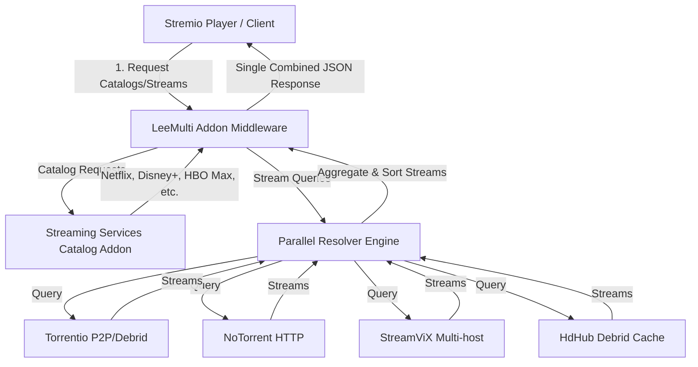

# LeeMulti Stremio Addon Design Specification

The **LeeMulti Addon** is a consolidated Stremio addon that acts as a middleware router and multiplexer. It combines catalog metadata and stream resolutions from multiple underlying addons into a single installable Stremio endpoint.



---

## 1. How It Works

Stremio addons communicate over HTTP using a simple JSON protocol. By exposing a single service conforming to this protocol, **LeeMulti** can multiplex operations:

1. **Manifest (`/manifest.json`)**: Declares its name (`LeeMulti`), catalogs (Netflix, HBO Max, Disney+, Prime Video, Apple TV+), and stream capabilities for movies and series.
2. **Catalog Proxying (`/catalog/{type}/{id}.json`)**: Redirects or proxies metadata requests to the Streaming Catalogs addon, exposing catalogs like "Netflix" or "Disney+" under the unified `LeeMulti` name.
3. **Stream Aggregation (`/stream/{type}/{id}.json`)**: 
   When a user clicks play, Stremio requests streams. LeeMulti catches this query, fetches streams from **Torrentio**, **NoTorrent**, **StreamViX**, and **HdHub** simultaneously, merges the results, and returns them as a single consolidated list.

---

## 2. Serverless Cloudflare Worker Implementation (JavaScript)

Deploying as a **Cloudflare Worker** is the best option: it has a generous free tier (100,000 requests/day), requires zero server setup, and has sub-millisecond execution times.

Below is the complete, self-contained code for the worker:

```javascript
const ADDON_NAME = "LeeMulti Addon";
const ADDON_ID = "org.leemulti.addon";

// Target endpoints to aggregate
const CATALOGS_BASE = "https://7a82163c306e-stremio-netflix-catalog-addon.baby-beamup.club";
const NOTORRENT_BASE = "https://addon.notorrent2.workers.dev";
const STREAMVIX_BASE = "https://streamvix.hayd.uk/%7B%22tmdbApiKey%22%3A%22%22%2C%22mediaFlowProxyUrl%22%3A%22%22%2C%22mediaFlowProxyPassword%22%3A%22%22%2C%22animeunityEnabled%22%3A%22on%22%2C%22animesaturnEnabled%22%3A%22on%22%2C%22animeworldEnabled%22%3A%22on%22%7D";
const HDHUB_BASE = "https://hdhub.thevolecitor.qzz.io/eyJ0b3Jib3giOiJ1bnNldCIsInF1YWxpdGllcyI6IjIxNjBwLDEwODBwLDcyMHAiLCJzb3J0IjoiZGVzYyJ9";
const TORRENTIO_FREE_BASE = "https://torrentio.strem.fun/providers=yts,eztv,rarbg,1337x,thepiratebay,torrentgalaxy";

// Cors headers helper
const headers = {
  "Content-Type": "application/json; charset=utf-8",
  "Access-Control-Allow-Origin": "*",
  "Access-Control-Allow-Headers": "*"
};

export default {
  async fetch(request) {
    const url = new URL(request.url);
    const path = url.pathname;

    // 1. MANIFEST ENDPOINT
    if (path === "/manifest.json" || path === "/leemulti/manifest.json") {
      const manifest = {
        id: ADDON_ID,
        version: "1.0.0",
        name: ADDON_NAME,
        description: "Unified aggregator for catalogs (Netflix, Disney+, etc.) and streams (Torrentio, NoTorrent, StreamViX, HdHub).",
        resources: ["catalog", "stream"],
        types: ["movie", "series"],
        idPrefixes: ["tt"],
        // Proxy catalogs from Streaming Catalogs
        catalogs: [
          { id: "nfx", type: "movie", name: "Netflix (LeeMulti)" },
          { id: "nfx", type: "series", name: "Netflix (LeeMulti)" },
          { id: "hbm", type: "movie", name: "HBO Max (LeeMulti)" },
          { id: "hbm", type: "series", name: "HBO Max (LeeMulti)" },
          { id: "dnp", type: "movie", name: "Disney+ (LeeMulti)" },
          { id: "dnp", type: "series", name: "Disney+ (LeeMulti)" },
          { id: "amp", type: "movie", name: "Prime Video (LeeMulti)" },
          { id: "amp", type: "series", name: "Prime Video (LeeMulti)" },
          { id: "atp", type: "movie", name: "Apple TV+ (LeeMulti)" },
          { id: "atp", type: "series", name: "Apple TV+ (LeeMulti)" }
        ],
        // Allow configuring a custom Real-Debrid token during install
        behaviorHints: {
          configurable: true,
          configurationRequired: false
        }
      };
      return new Response(JSON.stringify(manifest), { headers });
    }

    // 2. CATALOG PROXYING
    // Matches: /catalog/:type/:id.json or /:config/catalog/:type/:id.json
    const catalogMatch = path.match(/(?:\/([^\/]+))?\/catalog\/([^\/]+)\/([^\/]+)\.json/);
    if (catalogMatch) {
      const [_, config, type, id] = catalogMatch;
      const targetUrl = `${CATALOGS_BASE}/catalog/${type}/${id.replace(".json", "")}.json`;
      
      try {
        const response = await fetch(targetUrl, { headers: { "User-Agent": "Mozilla/5.0" } });
        if (response.ok) {
          const data = await response.json();
          return new Response(JSON.stringify(data), { headers });
        }
      } catch (err) {
        return new Response(JSON.stringify({ metas: [], error: err.message }), { headers });
      }
    }

    // 3. STREAM AGGREGATION
    // Matches: /stream/:type/:id.json or /:config/stream/:type/:id.json
    const streamMatch = path.match(/(?:\/([^\/]+))?\/stream\/([^\/]+)\/([^\/]+)\.json/);
    if (streamMatch) {
      const [_, config, type, id] = streamMatch;
      const cleanId = id.replace(".json", "");
      
      // Determine Torrentio Configuration (use user's Real-Debrid key if passed in config URL)
      let torrentioUrl = `${TORRENTIO_FREE_BASE}/stream/${type}/${cleanId}.json`;
      if (config && config.includes("realdebrid=")) {
        const rdToken = config.split("realdebrid=")[1]?.split("|")[0];
        if (rdToken) {
          torrentioUrl = `https://torrentio.strem.fun/providers=yts,eztv,rarbg,1337x,thepiratebay,torrentgalaxy|realdebrid=${rdToken}/stream/${type}/${cleanId}.json`;
        }
      }

      // Targets to scrape
      const targetUrls = {
        torrentio: torrentioUrl,
        notorrent: `${NOTORRENT_BASE}/stream/${type}/${cleanId}.json`,
        streamvix: `${STREAMVIX_BASE}/stream/${type}/${cleanId}.json`,
        hdhub: `${HDHUB_BASE}/stream/${type}/${cleanId}.json`
      };

      // Perform parallel fetching
      const fetchPromises = Object.entries(targetUrls).map(async ([key, url]) => {
        try {
          const res = await fetch(url, { 
            headers: { "User-Agent": "Mozilla/5.0" },
            signal: AbortSignal.timeout(6000) // 6 second timeout
          });
          if (res.ok) {
            const data = await res.json();
            return { provider: key, streams: data.streams || [] };
          }
        } catch (e) {
          console.error(`Provider ${key} failed:`, e);
        }
        return { provider: key, streams: [] };
      });

      const results = await Promise.all(fetchPromises);
      let combinedStreams = [];

      results.forEach(res => {
        const labeledStreams = res.streams.map(stream => {
          // Append brand labels to stream titles for clarity in Stremio
          const suffix = `\n⚙️ LeeMulti • ${res.provider.toUpperCase()}`;
          return {
            ...stream,
            title: (stream.title || "") + suffix
          };
        });
        combinedStreams = combinedStreams.concat(labeledStreams);
      });

      // Simple deduplication or sorting (e.g. put RD/Premium streams at top)
      combinedStreams.sort((a, b) => {
        const aPremium = a.title.toLowerCase().includes("premium") || a.title.toLowerCase().includes("rd");
        const bPremium = b.title.toLowerCase().includes("premium") || b.title.toLowerCase().includes("rd");
        return bPremium - aPremium;
      });

      return new Response(JSON.stringify({ streams: combinedStreams }), { headers });
    }

    // Default 404
    return new Response(JSON.stringify({ error: "Not Found" }), { status: 404, headers });
  }
};
